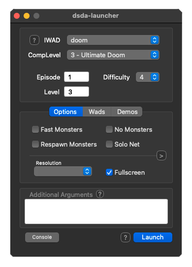
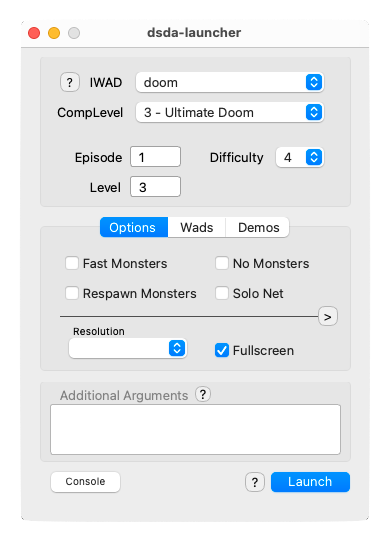
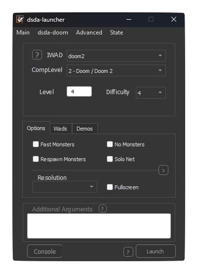
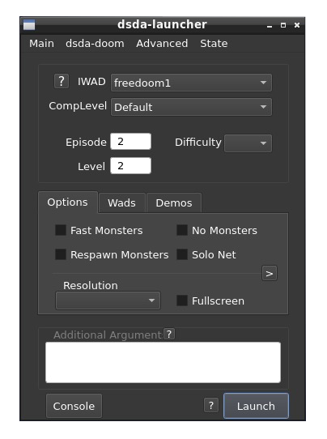
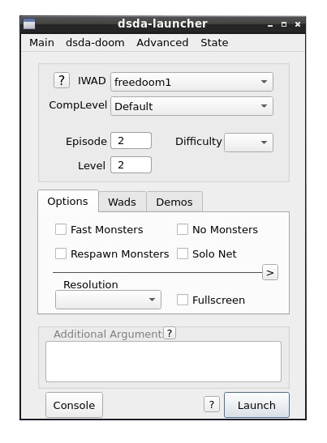

    
    <h1>dsda-launcher</h1>
    <h3>This is a launcher GUI for the <a href="https://github.com/kraflab/dsda-doom">dsda-doom</a> source port</h3>

 

For both casual players and experienced speedrunners, this launcher is everything you need to organize and launch the game. It has a very simple and intuitive graphical interface with the more advanced features working under the hood and in organized menus. dsda-launcher fits in your dsda-doom's installation with minimal footprint, and can even auto-update it.

[Doomworld thread](https://www.doomworld.com/forum/topic/121953-dsda-doom-source-port-on-mac-a-guide/)

## Downloads

Available for Windows, macOS and Linux in [Releases](https://github.com/Pedro-Beirao/dsda-launcher/releases/latest)

  
Dev builds

  
  <a href="https://github.com/Pedro-Beirao/dsda-launcher/actions">https://github.com/Pedro-Beirao/dsda-launcher/actions</a>

  Requires a github account to download and are only available for a 90 days after creation.
  
  > May be completely broken and unusable

## Key Features

- Basic launcher operations
- Special support for dsda-doom specific features
- Customizable toggles for quick switching parameters
- Auto-updating dsda-doom
- Ability to read the footer of demos and auto-loading the needed pwads
- Built in console, removing the need of showing an ugly CMD/Terminal window
- Endoom support
- Ease of running -help to see all supported parameters
- History list of past launched parameters, and loading them back in
- Saving the current state of the launcher to a file, and loading it back later
- Exporting the current state to a .bat/.sh script

## Screenshots

    
macOS

    

        
        
    

    
Windows

    

        
        
    

    
Linux

    

        
        
    

## Compiling

Code available at [https://github.com/Pedro-Beirao/dsda-launcher/](https://github.com/Pedro-Beirao/dsda-launcher/)

Instructions in [guides](./guides/)
